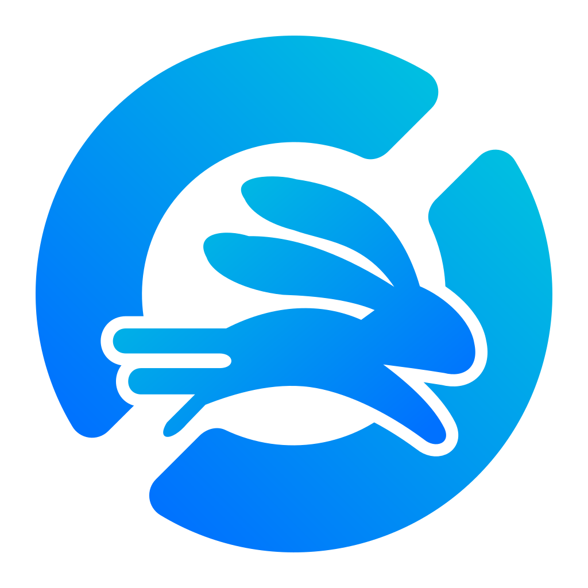
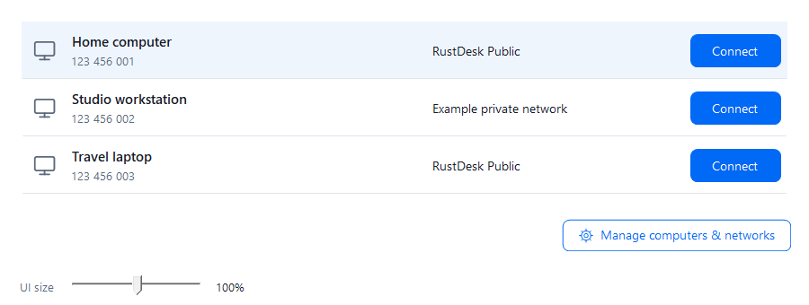

<p align="center">
  
</p>

# RustDeskHop — RustDesk Network Companion

RustDeskHop is an independent, community-driven companion for RustDesk, maintained as a hobby project. Official downloads are free of charge, and the source is licensed under [GNU GPLv3](LICENSE) (`GPL-3.0-only`). Contributions are welcome, including potential future collaboration with the RustDesk project. It is not currently affiliated with or endorsed by RustDesk.

**Public testing, not a broad production-readiness claim.** Everyone is welcome to test, [report bugs or request features](https://github.com/Deucarian/RustDeskHop/issues/new/choose), and contribute. Read the [remaining validation and known limitations](docs/TESTING.md). Branding clearance is still pending. Code signing is optional, not a GPL requirement; current downloads are unsigned and Windows may warn or block them. See the [code signing policy](docs/CODE_SIGNING.md), [branding record](docs/BRANDING.md) and [privacy policy](PRIVACY.md). Do not disable Windows security to run a download.

## Quick start

1. Use **Windows 11 x64** with a separately installed RustDesk. Other operating systems/architectures are not supported by this companion release; a .NET installation is not needed for self-contained downloads.
2. Open [Releases](https://github.com/Deucarian/RustDeskHop/releases). Prefer the versioned **installer** or **portable ZIP** from the same release. Installer support is introduced by the readiness changes; old releases do not gain it retroactively.
3. The installer creates a Start Menu shortcut for your account. Startup/desktop shortcuts are optional and default off. It does not install or stop RustDesk. Choose your install directory during setup.
4. In RustDeskHop, use **Manage networks**, then **Add computer**, then select a computer and **Connect**. Have a working private-network/VPN route when needed.

Exit RustDeskHop from its tray menu before upgrading; leave RustDesk running. Uninstall via Windows **Installed apps**. Settings and backups are retained. For a portable ZIP, exit the companion, remove only the extracted app folder and any shortcuts you created; retained settings are described below. Never remove RustDesk's own folders as part of companion uninstall.

RustDesk is excellent at connecting to devices, but it becomes awkward when one operator regularly uses more than one RustDesk network—for example, RustDesk's public network and a private self-hosted server.

This companion app provides a simple client-and-network launcher:

- Save named RustDesk network profiles.
- Associate each client with the network where its ID exists.
- Route each new connection through its assigned network, even when RustDesk's default is different.
- Keep existing RustDesk sessions open while connecting through another server.
- Confirm the route in a clear popup when it differs from RustDesk's default.
- Check private-server reachability before launching the connection.
- Detect an existing RustDesk account login and continue automatically.
- Guide the one-time public-server sign-in and resume the pending connection afterwards.

Normal connections use RustDesk's per-connection server syntax and do not rewrite its global configuration. The companion does not replace RustDesk, enter Google/Microsoft/GitHub credentials, or force-kill the RustDesk background service. Private profiles still require a working VPN or other route to the private server.

## The problem this solves

Without a network-aware launcher, users have to remember which server owns a RustDesk ID and manually change RustDesk's network settings. That can cause confusing “ID not found” errors and can interrupt existing sessions.

The intended workflow is:

1. Select a saved client.
2. The companion identifies the required network.
3. If it differs from the current RustDesk default, a confirmation explains that only the new connection is being routed differently.
4. Existing sessions remain connected.
5. The companion checks private-network reachability and opens the connection.

After the one-time RustDesk public-account setup, this is a single selection and confirmation. If public sign-in has never been completed, RustDeskHop can prepare the public profile with Windows administrator approval, open RustDesk, wait for the user to finish the browser login, and then continue the original connection automatically. Backups of any RustDesk configuration touched by this recovery flow are kept in a `RustDeskHop Backups` folder beside the original configuration.

Public outgoing connections require RustDesk's default network to be public. RustDeskHop uses the normal computer ID to retain RustDesk's account login; RustDesk 1.4.9 drops that login for an explicit `@public` target. Private connections still use an explicit server/key route. If the default is private, changing it requires a separate confirmation because it changes incoming registration and closes visible RustDesk sessions. If the default cannot be read, the public connection stops without changing anything.

## How to use RustDeskHop

For normal day-to-day use:

1. Open **RustDeskHop**.
2. Select the computer you want to reach.
3. Check that the displayed network is the one you expect.
4. Click **Connect** (or press Enter while the computer list is focused).
5. Approve the route confirmation if one appears.

That is the complete switching workflow. RustDeskHop routes the new connection through the network assigned to that computer. You do not need to edit RustDesk's server settings, restart RustDesk, or manually switch between public and private servers. Existing sessions on other networks stay open.

### One-time setup

Before the first connection from a particular PC:

- Install and start RustDesk.
- Sign in to RustDesk's public service when that PC will initiate public connections. RustDesk supports providers such as Google and GitHub.
- Enter the remote computer's password on the first connection and let RustDesk remember it if appropriate for that device.
- Start Tailscale, another VPN, or the required network route before using a private profile.
- Make sure the destination computer and its RustDesk server are online.

After those one-time steps, future connections should require only selecting the computer and clicking **Connect**.

### The desktop interface



*Production controls rendered with fictional data at 100% scaling; this preview is not evidence of a live connection.*

The light interface puts the computer list and connection actions in one rounded frame. **Connect** is the single blue primary action; **Add computer**, **Remove**, and **Manage networks** are quieter maintenance actions. A soft selection and neutral Public/Private badges keep the focus on the chosen computer. Default-network information sits in the muted footer. Arrow keys move through the computer list; Enter connects. Longer names wrap and longer lists scroll.

The rabbit icon stays in the title bar and taskbar, without a second oversized logo in the content. All windows use real Windows caption controls (minimize, maximize/restore, close), native resizing, snapping and the system menu—not text-symbol imitations. On Windows 11, the title bar blends into the app's light canvas using [Windows' supported caption-colour attributes](https://learn.microsoft.com/en-us/windows/win32/api/dwmapi/ne-dwmapi-dwmwindowattribute); older Windows versions retain standard system chrome, and high-contrast mode retains system caption colours. Network settings and the add-computer dialog share the same styling. These presentation changes do not change RustDesk routing or close existing sessions.

### System tray

Closing or minimizing the main window keeps RustDeskHop available in the Windows notification area. Click its tray icon (or right-click and choose **Open RustDeskHop**) to reopen it. Launching the application again also restores the existing window instead of creating a second tray icon. If Windows places it in the hidden-icons overflow, look under the **^** arrow beside the clock.

To quit completely, right-click the tray icon and choose **Exit**. Finish or cancel any open editor/confirmation first. Exiting RustDeskHop does not stop RustDesk or disconnect its sessions. Windows shutdown and sign-out still close the companion normally.

### Incoming connections to this PC

RustDeskHop controls the route used by **new outgoing connections**. It does not change this PC's incoming/default RustDesk registration during normal use. This means the PC can remain available through RustDesk's public service while it opens a separate connection through a private server.

For reliable unattended incoming access, keep the RustDesk background service installed and running, configure a permanent password, and give the connecting user this PC's RustDesk ID. The controlling computer must be signed in when RustDesk's public service requires it. RustDeskHop does not store remote-desktop passwords or account credentials.

### Troubleshooting

- **Public connection asks for login:** complete or renew RustDesk's browser sign-in, then retry from RustDeskHop. A cached token is not proof that RustDesk's server accepts the account. The companion's sign-in dialog waits for a changed saved login, or lets you explicitly choose **Retry connection** after finishing; an unchanged cached token cannot automatically dismiss it.
- **Private server is unreachable:** confirm the required VPN or Tailscale connection is active and the server is online.
- **Password prompt appears:** enter the remote computer's password and choose RustDesk's remember option if desired.
- **Rename a saved computer:** open **Manage networks**, select its network, and open **Computer names**. Edit the name, choose **Save network**, then **Close**. Unsaved edits are discarded when switching networks or closing. Only the RustDeskHop label changes; the RustDesk ID, route, remote hostname and saved authentication remain unchanged. No extra dashboard controls are needed.
- **Wrong network is shown:** use **Manage networks** or edit the saved client assignment before connecting.

## Configuration

On first run, use **Manage networks** and **Add computer** to configure the profiles and IDs for your environment. Settings are stored in:

```text
%APPDATA%\SimultriaRustDeskCompanion\settings.json
```

The public repository intentionally contains only generic defaults. A developer-specific `settings.local.json` may be placed beside the project file; it is ignored by Git and copied to the build output for local development.

Developer seed files are explicitly excluded from `dotnet publish`. Distribution validation rejects settings/TOML files, private-key containers and test-only assemblies.

Opening RustDeskHop does not rewrite your settings. If the file is damaged or unreadable, the app warns you and shows temporary default profiles while leaving the original untouched. An explicit save must first preserve a damaged file in `Settings Backups` beside `settings.json`; if the backup or save fails, the original is kept and the app reports the failure. Restore or repair the original before saving if you want to recover its saved computers.

Public sign-in preparation also requires successful RustDesk configuration backups before it sends any server-setting commands. If a later step fails, it attempts to restore only the options it tried to change, then restores the original user/service files. An incomplete restore reports the actual backup locations.

If UAC starts preparation as a different administrator, the helper refuses to change configuration. Ask an administrator to configure RustDesk, then sign in from your own Windows account. Routine outgoing connections require no elevation. Public preparation is not a harmless route switch: it can change incoming/default registration, so do not use it while relying on that private registration as your only access route.

Private-server probes support DNS names, IPv4 and IPv6 (including `[IPv6]:port` server addresses). An explicit probe host overrides the server hostname, and **Probe port** remains the port used for the reachability check.

## Build

Install the .NET 10 LTS SDK selected by `global.json`. No signing account, certificate, proprietary license, RustDesk artwork download, or paid tool is required to build from source.

```powershell
dotnet build RustDeskCompanion.csproj -c Release
dotnet test tests\RustDeskHop.Tests\RustDeskHop.Tests.csproj -c Release
```

The executable is produced under `bin\Release\net10.0-windows\`.

To build a self-contained distribution with notices:

```powershell
dotnet publish RustDeskCompanion.csproj -c Release -r win-x64 --self-contained true -p:PublishSingleFile=true -p:IncludeNativeLibrariesForSelfExtract=true -p:DebugType=None -p:DebugSymbols=false --output publish
./tools/Collect-ReleaseNotices.ps1 -AssetsFile obj/project.assets.json -PublishDirectory publish
./tools/Test-Publish.ps1 -PublishDirectory publish
```

For an installer, install the open-source Inno Setup compiler (6.4+), rerun the notice collector with `-InnoCompilerDirectory <compiler-folder>`, then run `./tools/Build-Installer.ps1 -PublishDirectory publish -OutputDirectory installer -Version <version> -Compiler <ISCC.exe-path>`. The installer script is public in `packaging/`; no additional EULA is imposed. CI runs install/upgrade/uninstall smoke tests only on disposable runners, never against your live installation.

### Application icon

**Edit only `Assets/RustDeskHop.svg`.** This is the single master, including the README. It preserves the user-selected **A / earlier thin-ring bunny** as an embedded image, with a precise vector ring and a white rounded tile. Do not maintain separate title-bar, taskbar, tray or shortcut artwork.

Every Windows build automatically runs `tools/Build-ApplicationIcon.ps1` when the master or renderer changes. The build-only .NET SVG renderer renders the master at its native resolution, then derives the multi-resolution ICO and preview PNG with no added transparent margin and no non-uniform stretching. No Node, Python, RustDesk installation or artwork download is needed. Outputs go under the build's intermediate `branding` directory, are embedded in the executable and copied into release `Assets/`; generated files are not committed. The release preview PNG is exactly the 256px frame contained in the ICO, not a second editable master.

The embedded approved artwork has SHA-256 `B4AAFD2C037A37C279283FDA94BA92511FE92CA29B2E68A47F99CB1C82DC1378`; its original bunny pixels and colours are retained, not approximated by a new drawing. A clip selects the bunny and excludes its former ring. The ring's outer/inner radii are 414/338 (76-unit thin band). One half is reused with exactly `rotate(180)`, then the pair is aligned at -45/135 degrees to match RustDesk's diagonal opening direction. Both openings therefore have identical width and rounded endings by construction. The bunny's foreground clearance intentionally overlaps the left ring; the overall bunny logo is not rotationally symmetric. The tile uses RustDesk's 160/1024 corner-radius proportion. This is distinct companion artwork, not the original RustDesk logo. Regression tests protect the original embedded image, shared ring geometry, rendered openings, thin band, balanced frame coverage and shared Windows assets.

For local deployment, `tools/Update-LocalBranding.ps1 -InstallDirectory <installed app folder>` refreshes only existing RustDeskHop shortcuts targeting that installation. Its cache-keyed icon copy is derived automatically from the generated ICO, never edited independently. The updater also refreshes the executable's own icon entry with [Windows' targeted shell notification](https://learn.microsoft.com/en-us/windows/win32/api/shlobj_core/nf-shlobj_core-shupdateimagew), because newly pinned shortcuts may use that entry instead. It does not clear the global icon cache or restart Explorer. RustDesk itself retains its own icon. Use `-WhatIf` for a no-change preview.

To update an existing local installation, choose **Exit** from RustDeskHop's tray menu (leave RustDesk running), publish, then run `tools/Install-Local.ps1 -PublishDirectory <publish folder> -InstallDirectory <app folder> -BackupDirectory <new backup folder>`. This backs up the previous files and matching shortcuts, installs the generated assets, and automatically refreshes the shortcut icons. It does not create startup items or change saved computers, network settings, or RustDesk services.

## Branches and automation

- `develop` is the integration branch for ongoing work.
- `main` is the production branch.
- Pull requests targeting either branch run the Windows build check.
- Automated tests verify connection routing, RustDesk configuration detection, login detection, safe public-profile cleanup, and private-server probing.
- Every push to either branch produces a self-contained Windows ZIP artifact in GitHub Actions.

Builds also produce a per-user installer and test evidence. GitHub-hosted jobs validate the installed executable, shortcut behavior and uninstall data retention. Pinned workflow actions and dependency-update proposals help maintain the build chain. Tagged releases include provenance attestations, runtime notices, hashes and matching source. Stable releases require recorded branding clearance and completed manual validation. Signing is optional for both stable and prerelease downloads; releases disclose their signature status. If signing is enabled, a signing failure blocks publication rather than silently publishing unsigned files. These official-release checks do not restrict independent builds or forks.

Because this is a desktop utility, the automated deployment target is a downloadable build artifact rather than a server. Version tags also publish permanent GitHub Releases, as described below.

Feature ideas can be submitted through the repository's **Feature request** issue template.

Use the **Bug report** template for reproducible defects. Anyone with a GitHub account can participate; no invitation is needed. See [CONTRIBUTING.md](CONTRIBUTING.md). Report security vulnerabilities [privately](https://github.com/Deucarian/RustDeskHop/security/advisories/new), not in public issues.

## Downloads

The latest public release is always available from the stable link below:

<https://github.com/Deucarian/RustDeskHop/releases/latest>

Release files use versioned names such as `RustDeskHop-v0.1.0-win-x64.exe` and `RustDeskHop-v0.1.0-win-x64.zip`. Stable releases are created automatically when a version tag such as `v0.1.0` is pushed; tags such as `v0.1.0-beta.1` become prereleases.

New readiness-enabled releases include `LICENSE`, `RustDeskHop-v<version>-notices.zip`, `SHA256SUMS.txt` and a matching `RustDeskHop-v<version>-source.zip` alongside the Windows downloads. Installer/portable ZIP distributions include the notices, license and usage guide; standalone EXE users should retain the matching notices archive, especially when redistributing. Download the source archive from the same release as your executable to inspect, modify, or rebuild that version; the **Build** section above describes the build commands. Versioned names are retained even when navigating from the stable latest-release link.

Verify a download with `Get-FileHash <file> -Algorithm SHA256` against the matching checksum file. For releases with attestations, use `gh attestation verify <file> --repo Deucarian/RustDeskHop`. A checksum detects changed bytes; provenance identifies the build; neither substitutes for reviewing code or a Windows publisher signature. See [Code signing policy](docs/CODE_SIGNING.md) for the exact status.

## License

### Community commitment

Official RustDeskHop downloads will remain free of charge. This is the project's distribution policy, not a noncommercial restriction: [GPL permits others to charge for redistribution](https://www.gnu.org/licenses/gpl-faq.html.en#DoesTheGPLAllowMoney) while preserving recipients' rights under the license.

Future upstream contributions or a friendly repository handover to RustDesk are welcome subjects for discussion, not an agreement already made. A [GitHub repository transfer](https://docs.github.com/en/repositories/creating-and-managing-repositories/transferring-a-repository) changes repository administration; it is not a copyright assignment. Any copyright transfer would need a separate agreement with the relevant rights holders. Contributing here does not assign copyright, and this statement does not change the GPL rights already granted.

### License terms

RustDeskHop's original code, documentation, and included original artwork are licensed under the **GNU General Public License, version 3 only** (`GPL-3.0-only`). See [LICENSE](LICENSE) for the full terms.

You may use, study, modify, and redistribute RustDeskHop. If you distribute modified versions, you must license those versions under GPLv3 and make the corresponding source code available to recipients under its terms. Private modifications do not have to be published. Commercial use and redistribution are permitted; the official RustDeskHop downloads are provided free of charge.

RustDeskHop is provided without warranty, including without any implied warranty of merchantability or fitness for a particular purpose, to the extent permitted by law.

RustDesk is a separate application, is not bundled here, and remains under [its own license](https://github.com/rustdesk/rustdesk/blob/master/LICENCE). Third-party dependencies retain their respective licenses; see [THIRD-PARTY-NOTICES.md](THIRD-PARTY-NOTICES.md) and the resolved runtime notices in downloads. RustDesk's name and logo are not licensed by this repository, and RustDeskHop does not claim affiliation with or endorsement by RustDesk. No logo-use permission or signing approval is implied by this license; see the open [branding gate](docs/BRANDING.md).
